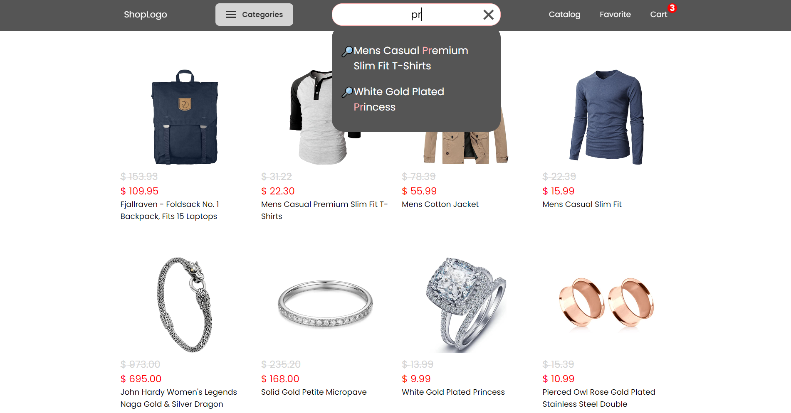

# Fake Shopping App

## Description
This app uses the [Fake Store API](https://fakestoreapi.com) to get product data and provides users with the ability to view, add to favorites and manage their shopping cart.

* [FAKE STORE](https://goldfakestore.netlify.app)


## Prerequisites
- [Node.js](https://nodejs.org/) (recommended version: 18.x or higher)
- [npm](https://www.npmjs.com/) (it is usually installed together with Node.js)
- [Git](https://git-scm.com/) (to clone a repository)

## Install
Follow these steps to install and run the project:

1. **Clone the repository**:
  ```bash
  git clone https://github.com/bidzyu/fake_store.git
  ```

2. **Go to the project directory**:
  `cd fake_store`

3. **Install dependencies**:
  `npm install`

4. **Run the project in dev mode**:
  `npm run dev`

## Technologies
**Main**:
- [React](https://react.dev) - library for creating user interfaces
- [Redux toolkit](https://redux-toolkit.js.org/) - a library for managing state in Redux-based applications
- [Vite](https://vite.dev/guide/) - a modern project collector
- [npm](https://www.npmjs.com) - package manager

**API**
- [Fake Store API](https://fakestoreapi.com) - free RESTful API that provides developers with sample product data across various categories for testing and prototyping applications.

## Scripts

-  `npm run dev` — Runs the project in development mode with Vite.
-  `npm run build` — Compiles the project using TypeScript and creates an assembly with Vite.
-  `npm run lint` — Checks the code for errors using ESLint.
-  `npm run preview` — Preview of the project build.
